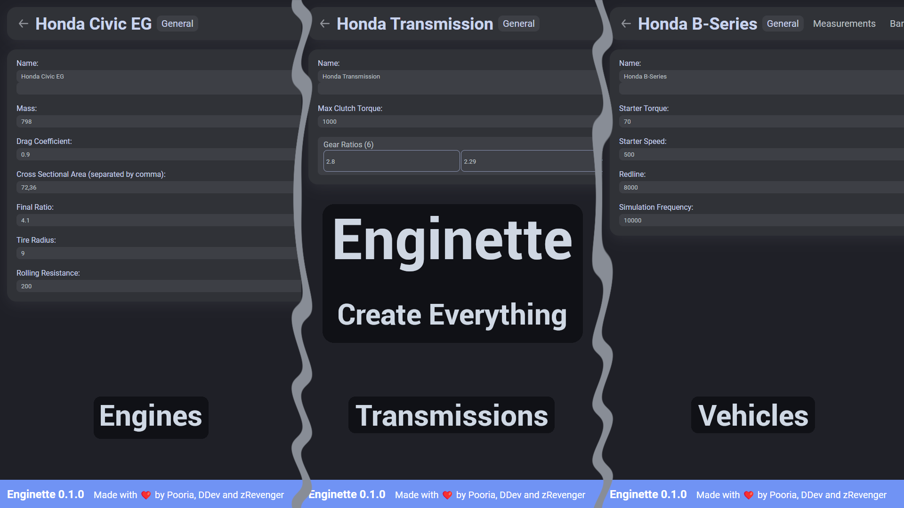

# Enginette
  An engine maker/editor for the [Engine Simulator](https://github.com/ange-yaghi/engine-sim) by [AngeTheGreat](https://github.com/ange-yaghi).
  
## Warning: Some stuff may not work. Please report any bugs to the [issues](https://github.com/Enginette/enginette/issues) page.

---

# How to use
  You can go to [Enginette](https://enginette.netlify.app) now to visit the website and start making engines. We are currently at version `0.1.1`.
  
# How does this work?
  This project works by taking all of the required parameters and generating them into a [Piranha](https://github.com/ange-yaghi/piranha) script using the [Python Engine Generator](https://github.com/ange-yaghi/engine-generator). Then it can be used by the game.
  
